# ENDOCRAB 내시경용 봉합 장치 Fusion 360 상세 설계 명세서 (Illustrated Design Specification)

> **문서 버전:** v2.0 (도면 및 실물 분석 강화판)  
> **기준 특허:** 대한민국 공개특허 10-2021-0138938 (등록특허 10-2405791, 미국 패밀리 US12426873)  
> **기준 문헌:** *Nature Scientific Reports* (2024) 14:7289 (DOI: 10.1038/s41598-024-56484-6)  
> **설계 목적:** Autodesk Fusion 360 파라메트릭 3D 모델링, 조립체(Assembly) 구속, 기구학 시뮬레이션 및 Python API 스크립팅을 위한 완전 분석 설계 명세서.

---

## 1. 시스템 개요 및 실물 구성 (System Architecture & Real Prototype)

ENDOCRAB은 기존 클립(TTSC)의 낮은 봉합력과 복잡한 전층 수술의 한계를 극복하기 위해 개발된 **내시경 선단 부착형 4절 링크 + 래칫 기반 360° 연속 링 바늘 봉합 시스템**입니다.

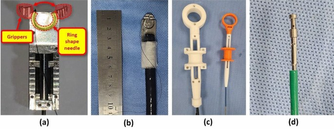
*(출처: Nature Scientific Reports, 2024 - Figure 3)*

### 주요 실물 모듈 구성
1. **메인 바디 & 결합부**: $50\text{ mm} \times 15\text{ mm} \times 5.45\text{ mm}$ 스테인리스 스틸 하우징. 표준 위내시경(Olympus GIF-Q260 등) 선단에 테이핑/스냅 체결.
2. **조직 그리퍼 (Tissue Gripper)**: 선단 최전방에 위치한 2개의 턱(6mm Jaws)으로 절개부 조직을 물어 고정.
3. **곡선형 링 바늘 (Ring Needle)**: 직경 $\varnothing 13\text{ mm}$의 원환체 바늘. 4-0 나일론 봉합사(Deknatel 52-R-NB4040)가 결합됨.
4. **이중 컨트롤러 (Dual Handlers)**:
   * **바늘 회전 컨트롤러 (Left)**: 방아쇠 트리거 조작으로 1회당 180°씩 바늘을 정회전 구동.
   * **그리퍼 조작 컨트롤러 (Right)**: 그리퍼 조의 개폐를 조작.
5. **매듭 고정 장치 (Knotting Device)**: Male stud와 Female ring으로 구성되어 체내에서 매듭을 형성하여 봉합사를 잠금.

---

## 2. 특허 도면별 상세 기구학 분석 (Patent Drawings Analysis)

---

### 2.1 전체 조립 및 부분 분해도 (Figures 1 & 2)

````carousel
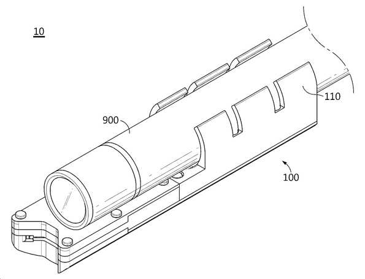
<!-- slide -->
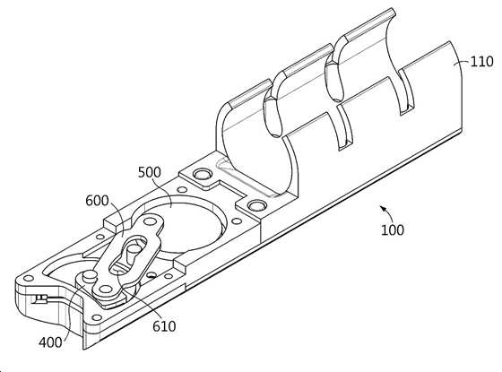
````

#### 기구학 및 CAD 모델링 분석:
* **도면 1 (Fig 1)**: 내시경용 봉합 장치(10)의 바디부재(100)는 결합부(110)를 통해 내시경(900)의 원위단(Distal Tip)에 장착됩니다. 내시경 카메라의 시야(FOV) 및 겸자 채널(Working Channel)의 출구를 침범하지 않도록 한쪽 측면으로 옵셋(Offset) 배치됩니다.
* **도면 2 (Fig 2)**: 내부 링크 어셈블리의 Z축 적층 구조를 보여줍니다.
  * **구동 링크 (500)**: 동력원 와이어에 연결되어 시계방향/반시계방향 180° 왕복 회전.
  * **종동 링크 (400)**: 니들 드라이버를 지지하며 바늘 중심축을 기준으로 180° 회전.
  * **연결 링크 (600)**: 구동 링크와 종동 링크를 연결하며, 중앙의 **가변 폭 관통홀(610)**이 바디 돌기부(120)와 슬라이딩 접촉.

---

### 2.2 동력 전달 및 스프링 복귀 단면 구조 (Figures 3 & 4)

````carousel
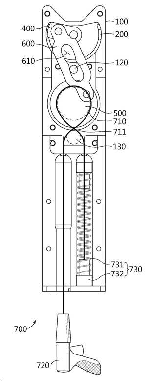
<!-- slide -->
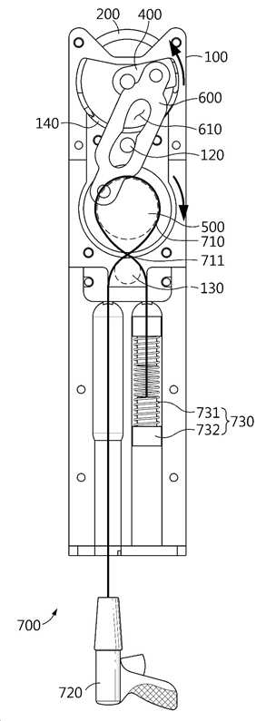
````

#### 단면 메커니즘 분석 (Sectional Kinematics):
* **와이어 교차 배선 (710, 711)**:
  * 구동 와이어(710)는 구동 링크(500)의 외주 풀리 홈에 1회 권취된 후 **교차점(711)**을 형성하며 바디의 와이어 지지부(130)를 거칩니다.
  * 와이어의 좌측 끝단은 시술자 핸들(720)로 인출되고, 우측 끝단은 바디 내부의 **탄성부재(730: 코일스프링 731 + 압축블록 732)**에 연결됩니다.
* **정회전 행정 (도면 3 $\to$ 도면 4)**:
  * 핸들(720) 트리거를 당기면 와이어(710)가 인장되면서 구동 링크(500)가 시계방향($\text{CW}$)으로 180° 회전.
  * 연결 링크(600)가 밀려나면서 종동 링크(400)가 반시계방향($\text{CCW}$)으로 180° 회전하여 바늘(200)을 180° 전진 구동.
  * 동시에 와이어 타측의 압축부(732)가 스프링(731)을 최대로 압축.
* **복귀 행정 (도면 4 $\to$ 도면 3)**:
  * 트리거를 놓으면 압축된 스프링(731)의 탄성 복원력에 의해 와이어가 반대로 당겨지며 구동 링크(500)와 종동 링크(400)가 180° 역회전하여 원위치 복귀.

---

### 2.3 사점 극복용 캠 관통홀 링크 상세 (Figure 5)

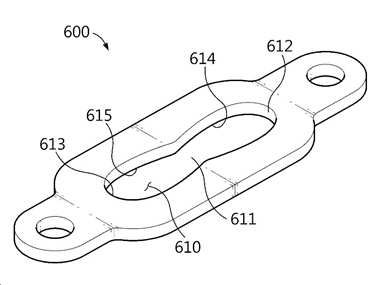

#### 기하학적 파라미터 및 사점 극복 원리:
* **구조 치수**:
  * 연결 링크(600) 양단 핀간 거리: $L = 22.0\text{ mm}$, 핀 홀 직경: $\varnothing 1.5\text{ mm}$
  * 관통홀(610): 전체적으로 곡선 호(Arc) 형상.
  * **중심부 (611)**: 기준 폭 $W_{mid} = 1.6\text{ mm}$ (돌기 핀 120 직경 $1.5\text{ mm} + 0.1\text{ mm}$ 여유).
  * **제1/제2 확장부 (614, 615)**: 중심부에서 양 단부로 향하는 중간 지점에서 최대 폭 $W_{max} = 2.4\text{ mm}$로 팽창.
  * **제1/제2 단부 (612, 613)**: 다시 $W_{end} = 1.6\text{ mm}$로 축소 대칭형 구조.
* **기구학적 역할 (사점 회피)**:
  * 4절 링크가 180° 큰 회전각을 회전할 때 종동 링크 최저점(Limit Point) 부근에서 발생하는 **특이점(Singularity) 및 링크 반전(Inversion)** 현상을 확장부(614, 615)의 백래시(Backlash) 여유 공간을 통해 기구적 걸림 없이 스무스하게 통과시킴.

---

### 2.4 래칫 드라이버 및 스토퍼 상호작용 (Figures 6 & 7)

````carousel
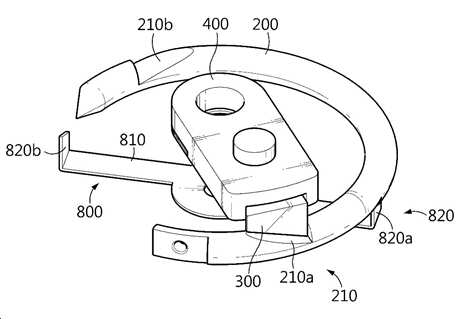
<!-- slide -->
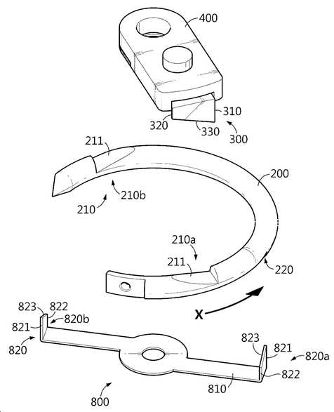
````

#### 래칫(Ratchet) 치형 형상 및 접촉면 분석:
1. **니들 드라이버 (300, 상면 구동)**:
   * **제1직선부 (310)**: 전방 수직 벽 (높이 $0.8\text{ mm}$). 바늘의 제2경사부(211) 수직단에 걸려 회전 토크를 $100\%$ 전달.
   * **제2직선부 (320)**: 후방 릴리프 벽 (높이 $0.2\text{ mm}$).
   * **제1경사부 (330)**: 경사각 $\alpha \approx 25^\circ \sim 30^\circ$. 종동링크 역회전 복귀 시 바늘 홈을 타고 위로 탄성 변형되며 미끄러져 빠져나옴.
2. **니들 스토퍼 (800, 하면 역회전 잠금)**:
   * 지지로드(810)에 일체형으로 형성된 한 쌍의 탄성 돌출부(820a, 820b).
   * **제3직선부 (821)**: 수직 걸림턱. 드라이버가 역회전할 때 바늘이 따라 역회전하는 것을 물리적으로 완전 차단.
   * **제3경사부 (823)**: 경사 램프면. 바늘이 정회전할 때는 탄성적으로 눌리며 바늘 통과 허용.

---

### 2.5 곡선형 링 바늘의 상/하면 상세 구조 (Figures 8 & 9)

````carousel
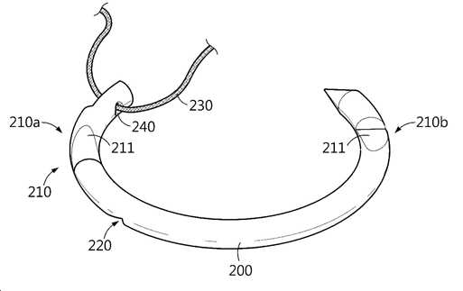
<!-- slide -->
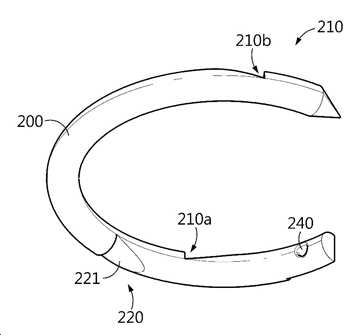
````

#### 바늘 3D 스케치 및 피처 스펙:
* **원환체 기본 형상**: 외경 $\varnothing 13.0\text{ mm}$, 내경 $\varnothing 10.6\text{ mm}$, 단면 사각 $1.2\text{ mm} \times 1.5\text{ mm}$.
* **상면 ($+Z$) 피처 (도면 8)**:
  * **한 쌍의 드라이버홈 (210a, 210b)**: $180^\circ$ 위상차 배치. 제2경사부(211)의 경사 방향은 바늘 진행 방향을 향함.
  * **봉합사 결합홀 (240)**: 후단부에 $\varnothing 0.4\text{ mm}$ 레이저 홀 가공. 봉합사(230) 결합.
* **하면 ($-Z$) 피처 (도면 9)**:
  * **스토퍼홈 (220)**: $180^\circ$ 위상차 배치. 제4경사부(221)와 역회전 방지 수직벽 구비.

---

### 2.6 7단계 연속 회전 시퀀스 선도 (Figure 10)

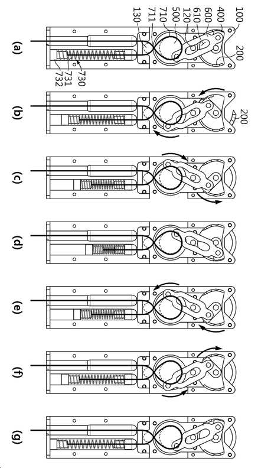

#### 7단계 상태 천이 다이어그램 (State Transition):
1. **(a) 초기 상태**: 와이어 인장력 없음, 스프링(731) 팽창, 드라이버가 홈 210a에 안착.
2. **(b) 전진 가속 (45°)**: 와이어 당김 시작, 구동링크 CW 회전 $\to$ 종동링크 CCW 회전 $\to$ 바늘 가압 회전.
3. **(c) 사점 접근 (90°)**: 핀(120)이 관통홀 확장부(614)를 통과하며 사점 간섭 회피.
4. **(d) 1차 180° 스트로크 완료**: 바늘 $180^\circ$ 회전 완료, 스프링(731) 최대 압축.
5. **(e) 복귀 시작**: 와이어 인장 해제, 스프링 복원력으로 구동/종동링크 역회전 시작. **바늘은 스토퍼(800)에 걸려 180° 위치에서 정지!**
6. **(f) 래칫 분리 복귀 (90°)**: 드라이버(300)가 바늘 경사면을 타고 넘어가며 원위치로 이동.
7. **(g) 원위치 복귀 및 2차 안착 (0°)**: 드라이버가 반대편 2번째 홈(210b)에 자동 안착. **[1회 스트로크 완료]**
   * *이후 (b)~(g)를 1회 더 반복하면 바늘이 180°에서 360°로 추가 회전하여 조직 1회 관통 완료.*

---

### 2.7 링크 사점 통과 비교 해석 (Figures 11 & 12)

````carousel
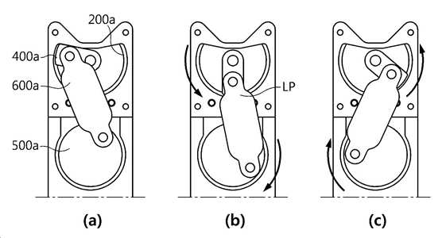
<!-- slide -->
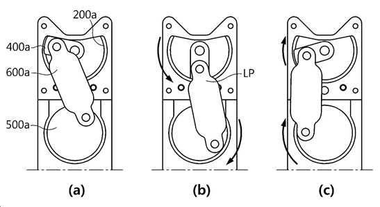
````

* **도면 12의 문제점**: 가변 슬롯 없이 고정 핀 링크를 사용할 경우 최저점(LP, Limit Point)에서 링크가 반대로 꺾여 종동 링크가 $180^\circ$까지 가지 못하고 도로 역회전함.
* **도면 11의 해결책**: 가변 관통홀(610)의 내부 여유 공간 덕분에 핀의 구속력이 적절히 해제되어 정방향으로 정확하게 $180^\circ$ 완전 회전이 가능함.

---

## 3. 실제 임상 봉합 프로토콜 (Surgical Suturing Sequence)

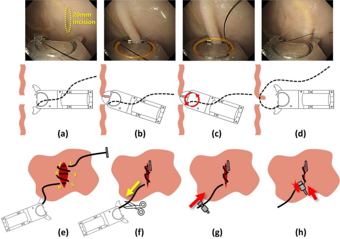
*(출처: Nature Scientific Reports, 2024 - Figure 4)*

1. **(a) 그리퍼 오픈**: 천공 부위에 접근 후 그리퍼 턱(6mm Jaws) 개방.
2. **(b) 조직 파지**: 위벽 천공 경계부 점막-점막하층 조직을 단단히 파지.
3. **(c) 링 바늘 360° 회전 관통**: 바늘 트리거 2회 조작으로 링 바늘이 360° 회전하며 파지된 조직 관통.
4. **(d) 다음 봉합점 이동**: 그리퍼를 열어 조직을 풀고 다음 절개부 위치로 이동하여 연속 봉합(총 6회 관통 / 3회 스티치).
5. **(e) 내시경 발거**: 6회 관통 완료 후 내시경을 체외로 서서히 인출.
6. **(f) 봉합사 절단**: 체외로 연결된 봉합사 절단.
7. **(g) 매듭 장치 통과**: 절단된 봉합사를 매듭 장치(Male stud)의 사선 홀에 통과시킨 후 내시경 겸자로 밀어 넣음.
8. **(h) 매듭 체결 및 잠금**: Female ring을 체결하여 봉합사를 완벽히 잠그고 남은 실을 커팅하여 시술 완료.

---

## 4. Fusion 360 조인트 및 파이썬 API 매핑 정의표

### 4.1 Fusion 360 어셈블리 조인트 설정표

| 조인트 ID | Component 1 | Component 2 | Fusion 360 Joint Type | 한계 및 오프셋 (Limits & Offsets) |
| :--- | :--- | :--- | :--- | :--- |
| `J_BodyGround` | `MainBody` | `Origin` | `Rigid` | 완전 고정 |
| `J_DrivingLink` | `DrivingLink` | `MainBody` | `Revolute` | Axis: Z, Limits: $0^\circ \sim 180^\circ$ |
| `J_DrivenLink` | `DrivenLink` | `MainBody` | `Revolute` | Axis: Z, Limits: $0^\circ \sim 180^\circ$ |
| `J_LinkPin1` | `ConnectionLink` | `DrivingLink` | `Revolute` | Axis: Z Pin |
| `J_LinkPin2` | `ConnectionLink` | `DrivenLink` | `Revolute` | Axis: Z Pin |
| `J_CamSlot` | `ConnectionLink` | `CamPin_120` | `Pin-Slot` / `Contact` | Slot 610 내부 슬라이딩 |
| `J_RingNeedle` | `RingNeedle` | `MainBody` | `Revolute` | **No Limit (360° 연속 회전)** |
| `CS_Driver` | `DriverTooth_300` | `Groove_210a/b` | `Contact Set` | CCW 가압 구동, CW 슬라이딩 분리 |
| `CS_Stopper` | `StopperPawl_820`| `Groove_220` | `Contact Set` | CW 회전 잠금, CCW 탄성 통과 |

---

## 5. 결론 및 Fusion 360 구현 체크포인트

1. **완전한 기하학적 치수 준수**: 외형 $50 \times 15 \times 5.45\text{ mm}$, 링 바늘 $\varnothing 13\text{ mm}$, 그리퍼 $6\text{ mm}$를 기준 파라미터로 설정하여 모델링.
2. **사점 극복 슬롯 구현**: 연결 링크(600)의 관통홀(610)은 중심폭 $1.6\text{ mm}$, 최대폭 $2.4\text{ mm}$의 곡선 스케치로 정확히 커팅.
3. **래칫 접촉 세트 활성화**: Fusion 360 시뮬레이션 시 Contact Sets를 활성화하여 왕복 운동이 단방향 360° 연속 회전으로 정류(Rectification)되는지 모션 검증.

