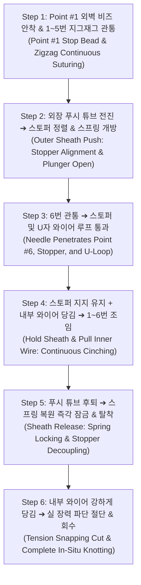

# ENDOCRAB 체내 봉합 마감 모듈 v3.2 최종 확정 설계 명세서
(ENDOCRAB In-Situ Knotting Module Final Design Specification - v3.2)

---

## 1. 개요 및 설계 배경 (Executive Summary)

* **수술적 배경:** ENDOCRAB 시스템은 내시경 선단에 부착되어 $13\text{ mm}$ 링 바늘(Ring Needle)과 $6\text{ mm}$ 듀얼 조직 집게(Dual Grippers)를 통해 1번부터 6번 포인트까지 지그재그 형태로 위장관 조직을 연속 관통하는 첨단 내시경 수술 기구임.
* **기존 논문의 치명적 병목 (Paper Bottleneck):**
  * 1번부터 6번까지 연속 봉합을 완료한 후 매듭(Knot)을 짓기 위해 **내시경 전체를 환자 체외로 완전히 빼내어 실을 꿰고 다시 삽입(Re-insertion)해야 하는 체외 탈착 방식**으로 인해 수술 시간과 합병증 위험이 극심했음.
* **v3.2 핵심 혁신 목표:**
  1. 내시경을 체외로 빼지 않고 **체내(In-Situ)에서 100% 원스톱으로 봉합 및 매듭을 종결**함.
  2. **동축 이중 푸시-풀 메커니즘 (Coaxial Push-Pull Mechanism):** 
     - **외장 푸시 튜브(Outer Push Sheath):** 스토퍼를 상처에 밀착 지지하고 스프링 플런저를 앞으로 꾹 눌러 관통홀을 **개방(Push & Hold Open)**.
     - **내부 견인 와이어(Inner Pull Wire):** 스토퍼가 열려 있는 상태에서 푸시 튜브 중심을 통해 U자 루프로 실을 **뒤로 당겨 조임(Pull & Cinch)**.
  3. **스프링 코드락 원터치 잠금 & 탈착:** 조임 완료 후 푸시 튜브의 전방 압력을 해제하면 내장 스프링이 복원되며 즉시 $20\text{ N}$ 이상 자가 잠금(Self-Locking) 및 기구 탈착 완료.
  4. **U자형 Nitinol 루프 도르래 조임:** 미세 실 파지(Pinch Grip) 실패를 원천 제거하고, $\varnothing 3.5\sim 4.0\text{ mm}$의 넓은 U자 루프로 6번 바늘을 포획하여 체외에서 당겨 1~6번 조직을 신발끈처럼 완벽하게 조임.
  5. **장력 파단 기반 단순화 절단(Tension Snapping):** 스토퍼의 강력한 파지력($>20\text{ N}$)을 기반으로, 복잡한 전용 칼날 기구 없이 내부 와이어 당김 장력만으로 봉합사를 분리/절단하여 기구를 극도로 슬림화함.

---

## 2. 6번 관통 후 기구학적 직렬 배치 구조 (Kinematic Serial Alignment)

6번 바늘이 마지막 조직을 관통해 나올 때, 봉합 부위는 다음과 같이 완벽한 직렬(In-line) 배치를 형성합니다.

```text
 [Point #6 환부 조직 외벽] (Tissue Wall)
           │
           │  - 4-0 봉합사 (Suture Line, Point #6 관통부)
           ▼
 ┌────────────────────────────────────────────────────────┐
 │   ② 스프링 코드락 스토퍼 (Stopper Body)                 │  <--- 상처 외벽 표면에 바짝 밀착 대기
 └───────────────────────────┬────────────────────────────┘
                             │  - 봉합사 관통
                             ▼
 ┌────────────────────────────────────────────────────────┐
 │   ③ U자형 연장 와이어 (Nitinol U-Wire Loop Tip)        │  <--- 스토퍼 직후에서 실을 U자로 걸침
 │   (※ 내부 견인선 Inner Pull Wire의 최선단 일체형 루프)    │
 └───────────────────────────┬────────────────────────────┘
                             │  - 봉합사 (바늘 끝단에서 이어짐)
                             ▼
 ┌────────────────────────────────────────────────────────┐
 │   ④ ENDOCRAB 메인 본체 (Main Chassis)                  │  <--- 13mm 링 바늘 회전 궤적 베이스
 └────────────────────────────────────────────────────────┘
```

---

## 3. 핵심 메커니즘: 동축 이중 푸시-풀(Coaxial Push-Pull) 구동 원리

스토퍼의 스프링을 눌러 구멍을 **열어두는 힘(Push)**과 봉합사를 **뒤로 당기는 힘(Pull)**은 서로 반대 방향이므로, 본 시스템은 **2개의 동축(Coaxial / Nested) 구조**로 독립적인 상대 운동을 수행합니다.

```
                  [동축 이중(Coaxial) 푸시-풀 메커니즘 단면도]

 ┌────────────────────────────────────────────────────────────────────────┐
 │ ① 외장 푸시 튜브 (Outer Push Sheath, Ø 1.4 mm)                         │ ──> [앞으로 밀기 (Push)]
 │   - 스토퍼 하우징을 상처에 밀착 지지 & 플런저를 꾹 눌러 개방(Open) 상태 유지    │     (스토퍼 정렬 및 개방)
 │ ┌────────────────────────────────────────────────────────────────────┐ │
 │ │ ② 내부 견인 와이어 (Inner Pull Wire + Nitinol U-Loop, Ø 0.25 mm) │ │ ──> [뒤로 당기기 (Pull)]
 │ │   - 푸시 튜브 중심을 관통하여 스토퍼 구멍을 지나 선단 U자 루프로 연결   │ │     (봉합사 도르래 Cinching)
 │ └────────────────────────────────────────────────────────────────────┘ │
 └────────────────────────────────────────────────────────────────────────┘
```

### 3.1. 5단계 기구학적 상대 운동 시퀀스
1. **[Step 1: 정렬 및 스토퍼 개방 (Push & Open)]**
   * 체외 조작으로 **① 외장 푸시 튜브**를 앞으로 밀어 스토퍼를 6번 상처 표면에 밀착 정렬.
   * 푸시 튜브 선단이 스토퍼의 스프링 플런저를 전방으로 압축하여 외통 구멍과 플런저 구멍을 일치시킴으로써 **봉합사 관통홀을 100% 개방(Free-Pass)** 상태로 유지.
2. **[Step 2: 6번 바늘 관통 (Needle Penetration)]**
   * 링 바늘이 6번 조직을 뚫고 나오며 개방된 스토퍼 구멍과 **② 내부 견인 와이어** 선단의 U자 루프($\varnothing 3.5\sim 4.0\text{ mm}$)를 통과하여 실을 걸침.
3. **[Step 3: 신발끈 연속 조임 (Hold & Pull Cinching)]**
   * **① 외장 푸시 튜브**는 스토퍼가 뒤로 밀리지 않도록 **전방 압력을 계속 유지(Hold & Open)**함.
   * 그 상태에서 **② 내부 견인 와이어**만 체외에서 뒤로 쑥 당김(Pull).
   * 봉합사가 U자 루프를 타고 미끄러지며(도르래 원리) 열려 있는 스토퍼 구멍을 통해 뒤로 당겨와 **1~6번 조직 전체가 신발끈처럼 쫙 모여 닫힘**.
4. **[Step 4: 스토퍼 즉각 잠금 & 탈착 (Release & Lock)]**
   * 상처가 완전히 닫히면 **① 외장 푸시 튜브**의 전방 압력을 해제하고 뒤로 후퇴(Release).
   * 플런저를 누르던 힘이 사라지며 내장 마이크로 스프링이 복원 팽창 ➔ 톱니가 실을 콱 물어 **$20\text{ N}$ 이상의 힘으로 영구 자가 잠금(Self-Locking)**.
   * 동시에 푸시 튜브와 스토퍼의 결합이 풀리며 스토퍼는 환부 표면에 남겨지고 기구는 분리(Decoupling)됨.
5. **[Step 5: 장력 파단 절단 & 회수 (Tension Snapping Cut)]**
   * 스토퍼가 잠긴 상태에서 **② 내부 견인 와이어**를 체외에서 한 번 더 강하게 당김.
   * 4-0 나일론 실의 인장 파단 하중($\approx 20\text{ N}$)에 의해 스토퍼 직후에서 실이 톡 끊어지며 깔끔하게 절단/분리되고, 외장 카테터 전체를 체외로 회수함.

---

## 4. 세부 수술 작동 시퀀스 (Step-by-Step Kinematic Workflow)



---

## 5. 정밀 엔지니어링 CAD 부품 사양표 (Engineering Specification Matrix)

| 구분 (Module) | 핵심 구성 부품 | 주요 치수 및 형상 사양 | 적용 재질 (ASTM/ISO) | 주요 기계적 특성 및 기능 |
| :--- | :--- | :--- | :--- | :--- |
| **스토퍼**<br/>(Stopper) | **외통 하우징** | 외경 $\varnothing 1.40\text{ mm} \times 2.40\text{ mm}$, 플랜지 $\varnothing 1.60\text{ mm}$ | Ti-6Al-4V ELI (ASTM F136) | 조직 파고듦 방지, 생체적합성 ISO 10993 |
| | **내통 톱니 플런저** | 외경 $\varnothing 0.95\text{ mm}$, 관통홀 $\varnothing 0.30\text{ mm}$, $45^\circ/90^\circ$ 톱니 | Ti-6Al-4V / Medical PEEK | **진입 마찰 $<0.5\text{ N}$, 자가 잠금력 $>20.0\text{ N}$** |
| | **마이크로 스프링** | 선경 $\varnothing 0.10\text{ mm}$, 외경 $\varnothing 0.90\text{ mm}$, 자유장 $1.20\text{ mm}$ | 316LVM / Nitinol (ASTM F2063) | 스프링 상수 $k=0.5\text{ N/mm}$, 프리로드 $0.15\text{ N}$ |
| **동축 구동**<br/>(Coaxial System) | **① 외장 푸시 튜브** | 외경 $\varnothing 1.40\text{ mm}$, 내경 $\varnothing 0.95\text{ mm}$ (코일 보강) | Pebax 7233 + Flat Wire Coil | **스토퍼 전방 가압/개방 지지, 좌굴 강도 $>30\text{ N}$** |
| | **② 내부 견인 와이어** | 외경 $\varnothing 0.25\text{ mm}$ Multi-strand Wire (중심 관통) | 316L Stainless Steel | 인장 파단 강도 $> 50\text{ N}$ (봉합사 인장 견인선) |
| **U자 가이드**<br/>(Pulley Loop) | **Nitinol U-루프** | 와이어 $\varnothing 0.10\text{ mm}$, 전개 루프폭 $3.5\sim 4.0\text{ mm}$ | SE508 Superelastic Nitinol | 내부 견인선 선단 결합, 조준 실패 $0\%$ |
| | **저마찰 코팅** | Parylene-C 또는 PTFE 코팅 (두께 $3\,\mu\text{m}$) | USP Class VI Polymer | **도르래 마찰계수 $\mu < 0.06$ (실 손상 방지)** |
| **1번 앵커** | **외벽 스토퍼 비즈** | 외경 $\varnothing 1.40\text{ mm}$, 플랜지 $\varnothing 1.80\text{ mm}$ | 316L Stainless Steel (ASTM F138) | 1번 외벽 지지력 $> 18.0\text{ N}$ |

---

## 6. 결론 및 향후 개발 과제 (Summary & Future Roadmap)

1. **기구의 물리적 타당성 및 신뢰성 확보:**
   * 외장 푸시 튜브(Push & Hold Open)와 내부 견인 와이어(Pull Cinch)의 동축 이중 구조를 확립함으로써, 상처 조임 중 스토퍼 밀림 및 조기 락킹 위험을 완벽히 해결함.
2. **향후 세부 과제:**
   * 푸시 튜브 선단과 스토퍼 플런저 간의 미세 접속 인터페이스 및 원터치 분리(Decoupling) 메커니즘 3D 모델링.

---
*문서 버전: v3.2 Confirmed Refinement Specification*  
*관련 HTML 명세서: `docs/knotting module 설계/내시경 설계 3ab1dee6affa8070ad65c5da75ccbe64.html`*

