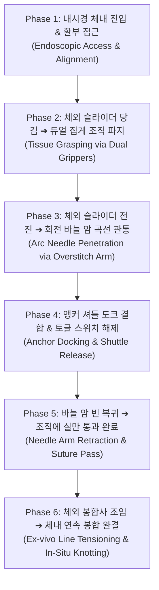

# ENDOCRAB & Overstitch 융합 실체 메커니즘 수술 모듈 확정 설계 명세서
(ENDOCRAB & Overstitch Hybrid Real-Mechanical Suturing & Knotting Module Specification)

---

## 1. 개요 및 설계 배경 (Executive Summary & Background)

* **배경 및 문제점:** 기존의 단공성 내시경 봉합 모듈 설계는 미세 마이크로 부품(슬리브, 스토퍼 등)에 치중하여, 실제 수술 환경에서 내시경 선단에 어떻게 장착되고 기계적 링크 및 바늘 구동 암이 어떻게 작동하는지 시각적·역학적 구조가 불명확하다는 한계가 있었음.
* **최종 설계 목표:** 실제 제작된 **ENDOCRAB 시제품 사진**의 차시 형상(듀얼 조직 집게, 링 바늘 가이드, 체외 핑거 링 핸들)과 글로벌 수술 기구인 **Boston Scientific / Apollo Endosurgery Overstitch (Overstitch Sx / NXT)**의 메커니즘(회전 바늘 드라이버 암, 앵커 자동 교환 메커니즘, 보울덴 케이블 구동)을 완벽하게 융합함.
* **결과물:** 체내 선단 모듈과 체외 조작 핸들이 통합된 총 11개 부품의 정밀 3D CadQuery Parametric CAD 모델 구축 및 전 부품 STEP CAD 도면 파일 완료.

---

## 2. 핵심 설계 의도 (Design Intent & Key Engineering Principles)

```
                            [ENDOCRAB + Overstitch 전체 메커니즘 구조]

   +-----------------------------------------------------------------------------------+
   |                           1. 체내 선단 모듈 (Distal Assembly)                      |
   |                                                                                   |
   |  [내시경 캡] <---> [ENDOCRAB 메탈 차시] <---> [듀얼 조직 집게 (좌/우)]               |
   |                          │                                                        |
   |                          ├───> [Overstitch 회전 바늘 암] <──> [봉합 앵커 셔틀]     |
   |                          │                                          │             |
   |                          └───> [앵커 수신 도크 (Dock)] <────────────┘             |
   +-----------------------------------------------------------------------------------+
                                             │
                                    [유연 케이블 카테터]
                                             │
   +-----------------------------------------------------------------------------------+
   |                         2. 체외 조작 모듈 (Proximal Handle)                      |
   |                                                                                   |
   |  [카테터 커플링 콘] ---> [핸들 샤프트 & 엄지 링] ---> [듀얼 핑거 슬라이더]          |
   |                                              ---> [앵커 교환 토글 버튼]           |
   +-----------------------------------------------------------------------------------+
```

### 3대 핵심 메커니즘 설계 의도

1. **Overstitch 회전 바늘 드라이버 암 (Swinging Curved Needle Driver Arm):**
   - 기존의 일자형 직진 구동 방식 대신, $12\text{ mm}$ 반지름의 호(Arc) 궤적을 그리며 $120^\circ$ 회전하는 곡선 바늘 암을 채택.
   - 두꺼운 위장관(Stomach/GI wall) 조직을 원형으로 깔끔하게 관통하여 조직 찢어짐(Tear)을 방지하고 침투력을 극대화함.

2. **앵커 셔틀 및 디텐트 수신 도크 자동 교환 (Anchor Exchange Mechanism):**
   - 봉합사(실)가 결박된 **T-bar 봉합 앵커 셔틀 니들 팁**이 회전 바늘 암 끝단 소켓에 장착되어 조직을 관통.
   - 관통 후 반대편 **앵커 수신 도크(Receiver Dock)**의 $45^\circ$ 리드인 깔대기와 내부 디텐트 래치에 찰칵 고정되며, 체외 버튼 조작으로 앵커만 도크로 전달(Exchange)된 후 바늘 암은 빈 상태로 복귀함.
   - **효과:** 내시경을 체외로 완전히 빼지 않고 체내에서 연속 봉합(Running Stitch/Purse-string) 가능.

3. **인체공학적 체외 핑거 링 조작 핸들 (Extra-Corporeal Control Handle):**
   - 집도의가 체외에서 내시경 조작부 근처에 착용하고 직관적으로 조작할 수 있는 핸들 모듈 설계.
   - **엄지 링(Thumb Loop, 내경 $24\text{ mm}$)**과 **이중 핑거 링 슬라이더(Dual Finger Rings, 내경 $20\text{ mm}$)**의 밀고 당기는 힘(Push-Pull)으로 체내 바늘 암의 회전력을 정밀 제어함.

---

## 3. 부품별 세부 사양 및 재질 (Component CAD Specifications)

| 부품 번호 | 부품명 (Component) | 주요 치수 사양 (Dimensions) | 적용 재질 (Materials) | 메커니즘 및 역학적 기능 |
| :---: | :--- | :--- | :--- | :--- |
| **01** | **내시경 부착 캡** | 내경 $\varnothing 11.5\text{ mm}$, 외경 $\varnothing 15.0\text{ mm}$, 길이 $16\text{ mm}$ | Anodized Aluminum / Medical ABS | 내시경 선단 클램핑 조임 고정 (M2.5 조임 볼트 내장) |
| **02** | **ENDOCRAB 메탈 차시** | $42.0 \times 16.0 \times 10.0\text{ mm}$ | Ti-6Al-4V Titanium Gr5 (ASTM F136) | 중앙 조직 유입 공간, 핀 힌지 축구멍, 케이블 가이드 유로 하우징 |
| **03, 04** | **듀얼 조직 집게 (좌/우)** | 길이 $14.0\text{ mm}$, 폭 $4.5\text{ mm}$, 4개 톱니 구조 | 17-4PH Stainless Steel | 젖은 조직 미끄러짐 방지 4-절편 파지 (Tissue Grasping) |
| **05** | **Overstitch 회전 바늘 암** | 암 반지름 $R = 12.0\text{ mm}$, 회전각 $120^\circ$ | 17-4PH / 316L Stainless Steel | 곡선 호 궤적 관통 구동 및 앵커 소켓 유지 |
| **06** | **앵커 수신 도크** | $8.0 \times 8.0 \times 10.0\text{ mm}$, $45^\circ$ 깔대기 | Martensitic 440C Stainless Steel | 앵커 팁 오차 흡수 정렬 및 디텐트 스프링 래치 수용 |
| **07** | **봉합 앵커 셔틀 팁** | 외경 $\varnothing 1.8\text{ mm}$, 길이 $9.0\text{ mm}$, $30^\circ$ 팁 | TiN Coated 316L Stainless Steel | $30^\circ$ 관통 팁, 원주 고정 노치, 봉합사 체결 홀 |
| **08** | **체외 핸들 샤프트** | 총길이 $135\text{ mm}$, 엄지 링 내경 $\varnothing 24\text{ mm}$ | White Medical ABS / Polycarbonate | 집도의 엄지 고정 및 이중 가이드 레일 슬라이딩 프레임 |
| **09** | **체외 핑거 슬라이더** | 본체 $35\text{ mm}$, 핑거 링 내경 $\varnothing 20\text{ mm}$ | Vibrant Safety Orange ABS | 검지/중지 조작 전후 진퇴 운동 ➔ 케이블 와이어 전달 |
| **10** | **앵커 토글 스위치** | $14.0 \times 10.0 \times 8.0\text{ mm}$, 미끄럼 방지 홈 | Dark Polycarbonate | 엄지 조작 앵커 소켓 락 해제 및 앵커 교환 트레이스 |
| **11** | **카테터 릴리프 부트** | 길이 $25\text{ mm}$, 외경 $\varnothing 8.0 \to \varnothing 3.6\text{ mm}$ | Medical Grade Silicone / Pebax | 외장 케이블 튜브 인입부 꺾임(Kinking) 및 좌굴 방지 |

---

## 4. 세부 수술 작동 시퀀스 (Step-by-Step Kinematic Workflow)



1. **Step 1 (조직 파지):** 체외 핸들의 슬라이더(09)를 조작하여 체내 듀얼 집게(03, 04)로 환부 봉합 조직을 강력하게 움켜쥐어 차시 중앙으로 당겨 올림.
2. **Step 2 (곡선 관통):** 체외 슬라이더를 밀어 보울덴 케이블을 구동하면, 회전 바늘 암(05)이 $12.0\text{ mm}$ 반지름의 호(Arc)를 그리며 조직을 곡선 관통.
3. **Step 3 (앵커 전달 및 해제):** 바늘 암 끝단의 셔틀 팁(07)이 앵커 수신 도크(06)의 깔대기로 진입하여 찰칵 결합됨. 체외 토글 스위치(10)를 눌러 바늘 암 소켓 락을 해제.
4. **Step 4 (암 복귀 및 실 전달):** 바늘 암만 빈 상태로 복귀하고, 실(Suture)이 연결된 앵커 셔틀은 반대편 도크에 남게 되어 실이 조직을 완전히 통과함.
5. **Step 5 (체내 조임 완결):** 내시경을 체외로 빼지 않고, 체외 라인을 당겨 1번부터 연속으로 신발끈처럼 조여 체내에서 봉합 마감(In-Situ Knotting) 완결.

---

## 6. 생성된 CAD 파일 및 시각화 도구 리소스

### 6.1 생성된 STEP CAD 도면 파일 (output/ 디렉토리)
- **전체 멀티바디 조립체 STEP:** [`ENDOCRAB_Overstitch_Knotting_System_Assembly.step`](file:///c:/Users/alvin/%EB%B0%94%ED%83%95%20%ED%99%94%EB%A9%B4/%EA%B3%A0%EB%8C%80/%ED%95%99%EC%97%B0%EC%83%9D/%EA%B3%A0%EA%B8%B0%20%EC%86%A1%EC%98%81%EB%82%A8%20STAR/output/ENDOCRAB_Overstitch_Knotting_System_Assembly.step) (1.15 MB)
- **개별 부품 STEP 11종:** `01_endoscope_distal_cap.step` ~ `11_catheter_strain_relief_cone.step`
- **CadQuery 자동 모델링 스크립트:** [`generate_realistic_endocrab_system.py`](file:///c:/Users/alvin/%EB%B0%94%ED%83%95%20%ED%99%94%EB%A9%B4/%EA%B3%A0%EB%8C%80/%ED%95%99%EC%97%B0%EC%83%9D/%EA%B3%A0%EA%B8%B0%20%EC%86%A1%EC%98%81%EB%82%A8%20STAR/generate_realistic_endocrab_system.py)

### 6.2 3D 검수 및 시각화 방법
1. **웹 브라우저 전용 3D 스튜디오:** [`endocrab_3d_studio.html`](file:///c:/Users/alvin/%EB%B0%94%ED%83%95%20%ED%99%94%EB%A9%B4/%EA%B3%A0%EB%8C%80/%ED%95%99%EC%97%B0%EC%83%9D/%EA%B3%A0%EA%B8%B0%20%EC%86%A1%EC%98%81%EB%82%A8%20STAR/endocrab_3d_studio.html) 파일을 Chrome/Edge에서 열어 3D 회전, 분해도(Exploded View) 슬라이더, 부품별 On/Off 검수 가능.
2. **VS Code OCP CAD Viewer:** `generate_realistic_endocrab_system.py` 실행 시 OCP CAD Viewer 탭으로 3D 모델 실시간 송출.

---
*작성일자: 2026년 7월 30일*  
*문서 버전: v3.0 Final Real-Mechanical Specification*  
*작성자: Antigravity AI Pair Developer*
