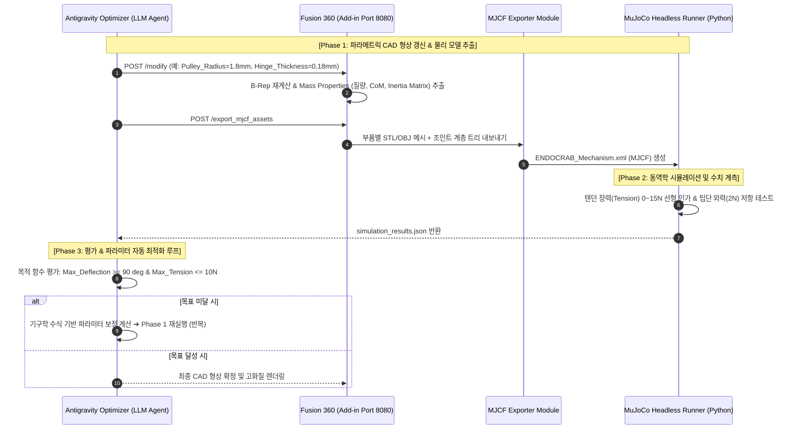
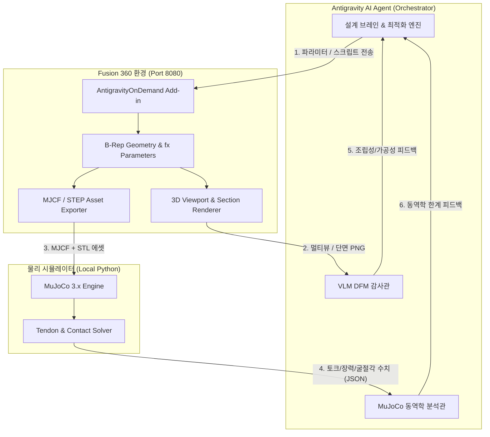

# Fusion 360 × Antigravity 파이프라인 고도화 기술 결정 문서 (ADR)
## : 내시경 수술 모듈(ENDOCRAB) 특화 물리 시뮬레이터(MuJoCo) 폐루프 및 멀티모달 VLM DFM 감사 시스템

**문서 번호:** ADR-2026-ENDO-002  
**작성 일자:** 2026-08-20  
**상태:** 확정 (Approved & Ready for Implementation)  
**대상 시스템:** Autodesk Fusion 360, Antigravity AI Agent, MuJoCo 3.x, Gemini 3.7 Vision / VLM  
**프로젝트:** ENDOCRAB 및 초소형 내시경 봉합/결찰 수술 모듈 설계 자동화  

---

## 1. 개요 및 배경 (Executive Summary)

현재 작업 공간(`ENDO`)에는 Fusion 360 상주 Add-in(`AntigravityOnDemand`, Port 8080), MCP Stdio 서버(`fusion360_mcp_server.py`), 커스텀 스킬(`fusion360-cad-automation`), 렌더링 룰(`fusion360-rendering-rule.md`)로 구성된 1세대 연동 파이프라인이 구축되어 있습니다.

그러나 **내시경 수술 모듈(ENDOCRAB Suture/Knotting)**과 같은 $\varnothing 15\text{ mm}$ 이하 초소형·텐던 구동 기구를 설계할 때 다음과 같은 근본적 한계가 발생하고 있습니다:
1. **정적/시각 위주의 검증 한계:** CAD 뷰포트 캡처 이미지만으로는 와이어 장력($T$), 바늘 회전 토크($\tau$), 조직 관통 저항력($F_{penetration}$), 앵커 디텐트 체결력 등의 역학적 타당성을 검증할 수 없음.
2. **닫힌 루프(Closed-Loop) 최적화 부재:** AI가 파라미터를 변경해도 물리적 실패(토크 부족, 와이어 파단 등)를 정량적으로 피드백받지 못해 '그럴듯한 형태'에 머무름.
3. **초소형 마이크로 DFM(제조/조립성)의 체계화 부재:** 와이어 관통 홀의 모서리 곡률 반경(Bend Radius), 마이크로 핀셋/지그 진입 공간(Tool Clearance), 박벽(Thin-wall) 파손 위험 등을 체계적으로 감사(Audit)하는 자동화 프로세스가 없음.

본 문서는 이를 극복하기 위해 **① Fusion 360 $\leftrightarrow$ MuJoCo 닫힌 루프 동역학 검증 파이프라인**과 **② 공간 지능 & 멀티모달 VLM 기반 초소형 DFM/조립성 자동 감사 시스템**을 규정하고, 다음 대화 세션에서 즉시 구현할 수 있는 상세 아키텍처 및 로드맵을 확정합니다.

---

## 2. 현재 구축된 1세대 파이프라인 종합 분석 (Current State Analysis)

### 2.1 기존 인프라 및 파일 구성

```
c:\Users\...\Desktop\ENDO\
├── .agents/
│   └── rules/
│       └── fusion360-rendering-rule.md     <-- [Rule] 블라인드 코드 생성 금지, 매 스텝 뷰포트 검수 강제
├── .gemini/
│   └── skills/
│       └── fusion360-cad-automation/       <-- [Skill] CadQuery STEP 파이프라인, REST 이벤트 규약
├── src/
│   ├── AntigravityOnDemand/
│   │   ├── AntigravityOnDemand.manifest
│   │   └── AntigravityOnDemand.py          <-- [Add-in] REST Server (Port 8080) & CustomEvent 마샬링
│   ├── fusion360_mcp_server.py             <-- [MCP Bridge] Stdio JSON-RPC Tool 브릿지
│   └── build_endocrab_model.py             <-- [CAD Script] ENDOCRAB 3D 파라메트릭 빌드 스크립트
└── docs/
    └── fusion360_antigravity_final_decision.md <-- 1세대 아키텍처 결정 문서
```

### 2.2 현 파이프라인의 강점과 한계 매트릭스

| 레이어 | 현재 구현 상태 | 강점 | 한계 및 병목 (한계 원인) |
| :--- | :--- | :--- | :--- |
| **통신 인프라** | `CustomEvent` 기반 메인 스레드 마샬링 (Port 8080) | Fusion 360 크래시(0%) 없이 파라미터/코드 실행 | 단방향 호출 중심, 물리 시뮬레이션 데이터 왕복 통로 부재 |
| **시각 검증** | `POST /animate_and_inspect` 다단계 캡처 | 0%, 50%, 100% 스트로크 시각 확인 | 2D 겉모습만 확인, 마찰/응력/장력/조립 간섭 수치 획득 불가 |
| **지오메트리** | CadQuery STEP + Pure Fusion 360 API | 곡면 로프트, 인볼루트 기어 형상 생성 가능 | B-Rep 토폴로지에서 질량/관성 텐서/조인트 한계치의 물리 엔진 직결 누락 |
| **최적화 루프** | 사용자-에이전트 수동 프롬프트 피드백 | 인간 설계자의 직관적 판단 수용 | 정량적 목표(예: 굴절각 90° @ 장력 < 10N) 기반 자동 파라미터 수렴 불가 |

---

## 3. 결정 1: Fusion 360 $\leftrightarrow$ MuJoCo 닫힌 루프 물리 검증 파이프라인

### 3.1 선정 이유: 왜 MuJoCo인가?
* **초소형 텐던(와이어) 메커니즘의 완벽한 지원:** MuJoCo 3.x는 3차원 공간 내 via-point와 풀리를 통과하는 `spatial tendon`과 `cable/flexure`를 해석 속도와 수렴 안정성 면에서 가장 탁월하게 처리함 (NVIDIA Isaac Sim 대비 가볍고 로컬 헤드리스 파이썬 구동이 100배 빠름).
* **접촉 역학(Contact Dynamics):** 앵커 셔틀이 도크 깔대기($45^\circ$)로 진입하여 디텐트 래치에 찰칵 결합되는 미세 접촉력 및 탄성 거동을 밀리초 단위로 시뮬레이션 가능.

### 3.2 닫힌 루프 아키텍처 (Closed-Loop Optimization Architecture)



### 3.3 MuJoCo 시뮬레이션 결과 데이터 규격 (`simulation_results.json`)

```json
{
  "mechanism_name": "ENDOCRAB_Swinging_Needle_Module",
  "convergence_status": "COMPLETED",
  "metrics": {
    "target_sweep_angle_deg": 120.0,
    "achieved_sweep_angle_deg": 118.4,
    "max_tendon_tension_N": 8.72,
    "tension_limit_N": 10.0,
    "is_tension_safe": true,
    "anchor_docking_success": true,
    "anchor_latch_engagement_force_N": 2.35,
    "tissue_penetration_support_force_N": 3.8,
    "buckling_risk_detected": false
  },
  "failure_reasons": []
}
```

---

## 4. 결정 2: 공간 지능 & 멀티모달 VLM 초소형 DFM / 조립성 감사 시스템

### 4.1 초소형 내시경 기구 특화 4대 DFM 검사 매트릭스

1. **와이어 라우팅 곡률 및 마찰 마모 검사 (Tendon Path Audit):**
   * 와이어 통과 채널 모서리의 Fillet/Chamfer 반경이 와이어 직경($\varnothing 0.2\text{ mm}$) 대비 1.5배 이상인지 검사 (와이어 피로 파단 방지).
2. **마이크로 조립 툴/지그 접근성 검사 (Micro-Tool Clearance Audit):**
   * 초소형 핀($\varnothing 0.8\text{ mm}$) 압입 홀 및 와이어 결속 매듭부 주변에 핀셋(Micro-forceps, 팁 폭 $1.2\text{ mm}$) 진입 공간 확보 여부 검사.
3. **박벽 및 가공성 한계 검사 (Thin-Wall & Machinability Audit):**
   * 3D 메탈 프린팅(DMLS) 또는 SUS 마이크로 CNC 가공 시 최소 벽 두께($t_{min} \ge 0.25\text{ mm}$) 준수 여부.
4. **체액 유입 및 세척/멸균 사장 공간 검사 (Dead-Space & Hygiene Audit):**
   * 체내 진입 시 혈액/조직액이 고여 세척이 불가능한 블라인드 포켓(Dead-space) 존재 여부.

### 4.2 다각도 단면(Cross-Section) & 투시 렌더링 파이프라인

`AntigravityOnDemand`에 단면 및 투시 캡처 엔드포인트를 추가하여 VLM에 고해상도 시각 데이터를 공급합니다.

```
[Fusion 360 Add-in]
  ├── POST /capture_dfm_views
  │     ├── Isometric_Wireframe.png       (전체 골격 및 와이어 경로 투시)
  │     ├── Section_Tendon_Channel.png    (와이어 통과 홀 내부 모서리 확대 단면)
  │     ├── Section_Pin_Assembly.png      (힌지 핀 및 결합 클리어런스 단면)
  │     └── Exploded_Assembly_View.png    (분해 조립 순서 시각화)
  ▼
[VLM DFM Auditor (Gemini 3.7 Vision)]
  └── DFM_Audit_Report.json 생성 (Pass / Warning / Fail 판정 및 수정 권고안)
```

### 4.3 VLM DFM 감사 결과 스키마 (`dfm_audit_report.json`)

```json
{
  "audit_timestamp": "2026-08-20T11:45:00Z",
  "overall_dfm_verdict": "WARNING",
  "findings": [
    {
      "category": "Tendon_Routing",
      "severity": "HIGH",
      "location": "P1_Needle_Arm_Guide_Hole",
      "issue": "와이어 꺾임 각도가 48도로 급격하며 내부 모서리에 Fillet이 적용되지 않아 장력 인가 시 와이어 피로 파단 위험.",
      "recommended_action": "Chamfer 0.15mm 또는 R0.2mm 필렛 추가 필요."
    },
    {
      "category": "Micro_Assembly",
      "severity": "LOW",
      "location": "Distal_Cap_M2_Bolt_Recess",
      "issue": "내시경 체결 볼트 헤드 주변 렌치 소켓 여유 공간 0.8mm 확보되어 조립 양호."
    }
  ]
}
```

---

## 5. 파이프라인 통합 아키텍처 (Total System Architecture)



---

## 6. 다음 대화 세션 구현 로드맵 (Handoff Implementation Roadmap)

다음 대화창으로 넘어가서 구현을 진행할 작업 목록입니다:

### Task 1: `AntigravityOnDemand.py` 기능 확장
* `POST /export_mjcf`: 활성 컴포넌트의 메시(STL) 및 질량 중심/관성 모멘트/조인트 링크 트리를 MuJoCo XML(MJCF) 호환 파일로 덤프하는 CustomEvent 추가.
* `POST /capture_dfm_views`: 특정 단면 평면(XY, YZ, ZX) 기준 슬라이스 단면 뷰 및 와이어프레임 렌더링 캡처 기능 추가.

### Task 2: MuJoCo 내시경 시뮬레이션 파이썬 러너 구축 (`src/mujoco_endo_sim.py`)
* `mujoco` 파이썬 패키지를 사용하여 생성된 MJCF를 헤드리스 로드.
* 텐던 액추에이터 구동, 팁단 2N 저항력 인가, 최대 굴절 각도 및 장력 한계치 검증 스크립트 작성.

### Task 3: VLM DFM 자동 감사 스크립트 및 프롬프트 템플릿 구축 (`src/vlm_dfm_auditor.py`)
* 캡처된 4개 DFM 뷰 이미지를 로드하여 초소형 의료기기 가공/조립성 체크리스트 기반 감사 보고서 JSON을 자동 생성하는 모듈.

### Task 4: Antigravity Custom Skill (`fusion360-cad-automation`) v2.0 업그레이드
* 위 2대 검증 프로토콜을 스킬 명세서에 정식 등록하여 에이전트가 CAD 모델링 시 자동으로 시뮬레이션과 DFM 감사를 수행하도록 바인딩.

---

## 7. 다음 대화 세션 인수인계용 프롬프트 (Handoff Prompt)

다음 대화창을 시작할 때 아래 블록의 내용을 그대로 복사하여 붙여넣으시면 즉시 구현 작업이 시작됩니다:

```markdown
[프로젝트 인수인계: Fusion 360 × MuJoCo × VLM DFM 파이프라인 구현]

우리는 내시경 수술 모듈(ENDOCRAB) CAD 모델링의 물리적 한계를 극복하기 위해,
'docs/fusion360_advanced_pipeline_decision.md' (ADR-2026-ENDO-002) 문서를 확정했습니다.

확정된 아키텍처에 따라 다음 4가지 핵심 구현 작업을 순차적으로 진행해 주세요:

1. `src/AntigravityOnDemand/AntigravityOnDemand.py` 확장:
   - MJCF 익스포트 커스텀 이벤트 (`/export_mjcf`)
   - DFM 단면 뷰 캡처 커스텀 이벤트 (`/capture_dfm_views`)
2. `src/mujoco_endo_sim.py` 제작:
   - 내시경 와이어 텐던 구동 및 팁단 반력/굴절각 자동 시뮬레이션 러너
3. `src/vlm_dfm_auditor.py` 제작:
   - 멀티모달 DFM & 마이크로 조립성 자동 감사 모듈
4. `.gemini/skills/fusion360-cad-automation/SKILL.md` v2.0 업데이트

먼저 1번 Add-in 확장 코드부터 작성해 주세요.
```
