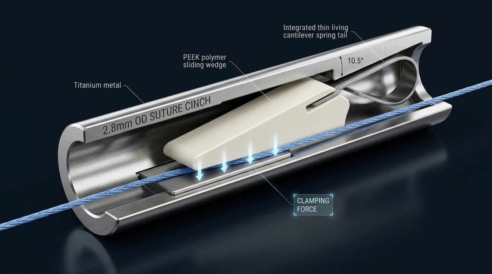

# 📘 [종합 백서] 초소형 내시경 봉합사 고정 캡 (Endo Suture Cinch)
### — 기획 배경, 물리 메커니즘, 3D 시각화 구조, 탄성 역학 및 실험 검증 마스터 사양서 —

---

## 📸 3D 엔지니어링 구조 및 컷어웨이 시각화 (Architecture Overview)



---

# 0. 🧭 프로젝트 발단 및 초기 문제 사항 (Why & Background)

유연 내시경(Flexible Endoscope) 환경에서 좁은 작업 채널($\varnothing 2.8\sim 3.2\text{ mm}$)을 통해 체내 깊숙이 접근하여, 의사의 손기술에 의존하는 **복잡한 수기 매듭(Hand-tied knot)을 대체할 초소형 자동/반자동 봉합사 고정 기구**를 개발하는 것이 본 프로젝트의 출발점입니다.

기존 상용 및 연구 단계의 방식들을 검토한 결과, 다음과 같은 **3대 환경적 제약과 물리적 한계**에 부딪혔습니다.

```
[ 기존 방식의 3대 한계점 ]
1. 조직 클립 (Hem-o-lok)  ──► 부피 있는 조직용 형상 ──► 얇고 미끄러운 실에 마찰력 부족 및 틈새 발생
2. 압착 방식 (Lapra-Ty)   ──► 높은 소성 변형력 필요 ──► 굴곡진 보우덴 케이블의 극심한 마찰 손실(힘 전달 불가)
3. 직선 T-태그 앵커       ──► 일직선 금속 부품      ──► 곡선 바늘 내부 수납 시 기하학적 간섭/모순 발생
```

### ① 기존 클립(헤모락, 엔도클립)의 한계
* 헤모락이나 지혈 클립은 굵고 푹신한 생체 조직을 압박하도록 설계되어 있어, **직경 $0.15\sim 0.35\text{ mm}$의 얇고 매끄러운 고분자 봉합사를 물기에는 미세 틈새(Gap)가 크고 마찰력이 턱없이 부족**하여 실이 쉽게 빠져버립니다.

### ② 압착(Crushing/Crimping) 방식의 한계
* 라프라-타이(Lapra-Ty)나 금속 슬리브를 찌그러뜨리는 방식은 고정력이 우수하지만, 유연 내시경의 길고 구불구불한 유연 관을 통과하는 **보우덴 케이블(Bowden Cable) 환경에서는 심각한 마찰 손실(Friction Loss $>80\%$)이 발생**하여, 기구를 소성 변형시킬 만한 충분한 악력($>50\sim 80\text{ N}$)을 원위부(Distal tip)에 전달할 수 없습니다.

### ③ 곡선 바늘(Curved Needle)과 직선 T-태그의 기하학적 모순
* 조직을 안정적으로 뜨기 위해서는 바늘이 '곡선(Curved)'이어야 하는데, 곡선 바늘 내강 안에 일직선 형태의 금속 T-태그 앵커를 수납하여 발사(Shooting)하려는 시도는 **기하학적 간섭(Interference)과 재밍(Jamming)**을 유발하여 기구의 복잡도와 고장률을 극단적으로 증가시킵니다.

---

# 1. 💡 도출된 핵심 설계 철학 (Paradigm Shift)

위 한계들을 극복하기 위해 **기구의 역할을 분리하고 구동 방식을 근본적으로 전환**하였습니다.

```
[ 패러다임 전환 1 : 역할의 완전한 분리 ]
• 바늘(Needle)  : 오직 "조직을 꿰매는 역할(Suturing)"만 전담 (구조 단순화)
• 고정 캡(Cinch): 오직 "봉합사를 잠그는 역할(Locking)"만 전담

[ 패러다임 전환 2 : 당김/압착 ❌ ──► 밀어넣기(Pushing) & 자가 잠금(Self-Locking) ⭕ ]
• 보우덴 케이블로 집게를 억지로 닫는 대신, 카테터를 따라 캡을 축 방향으로 '밀어 넣는(Pushing)' 방식으로 힘 손실 원천 회피.
• 실이 조직 장력으로 빠져나가려 할 때, 실 자체의 힘을 역이용하여 스스로 더 강하게 물리는 '자가 잠금' 구조 채택.
```

---

# 2. 🔄 4대 아이디어 검토 및 설계 진화 과정 (Evolution Flow)

```
[1단계: 4대 방식 검토] ──► [2단계: 도어스토퍼 구체화] ──► [3단계: 4-0 실 기하학 해결] ──► [4단계: 물성/양산 한계 극복 (최종 확정)]
• 콜릿/캔틸레버/캠 탈락   • 경사면 쐐기 원리 정립        • V-홈 실 숨음 방지           • 4-0 실 파단 방지 (하중 이원화)
• 슬라이딩 쐐기 채택       • 일체형 탄성 꼬리 도입        • Over-travel 여유 스트로크    • 위상 가위효과 제거 (평탄 크로스해치)
                                                    • 상단 DLC 저마찰 코팅        • PEEK 완충 소재 & 와이어 스네어 장전
```

### [Step 1] 초기 4대 메커니즘 비판 검토 및 선별
1. **아이디어 A (테이퍼드 콜릿 / 샤프펜슬):** 체액 윤활($\mu \approx 0.08$) 시 자가잠금각($\alpha \le 3^\circ$) 한계로 캡 길이가 너무 길어지고, 봉합사가 납작해지면 콜릿 스트로크 고갈로 미끄러짐 ❌
2. **아이디어 B (캔틸레버 래칫):** 날카로운 톱니의 국소 응력 집중($>200\text{ MPa}$)으로 얇은 실이 절단(Guillotine)되며, $20\text{ N}$ 역하중 시 빔 좌굴(Buckling) 반전 ❌
3. **아이디어 C (편심 캠 / Grigri):** 체액 윤활 시 초기 마찰 부족으로 헛돎(Free-slip), 미세 핀 굽힘 응력($>1,800\text{ MPa}$) 파손, 4부품 조립 불가 ❌
4. **아이디어 D (슬라이딩 쐐기):** **단 2개 부품, 넓은 면 접촉으로 실 보호, 체액 속에서도 수직 압착력 5배 자가증폭 $\to$ ⭐ 최종 단일 메커니즘 채택**

### [Step 2] 원리 정립 및 1차 보완 (도어스토퍼 & 예압)
* **도어스토퍼 원리:** 문을 밀 땐 스토퍼가 밀려나 통로가 열리고, 문이 닫히려고 하면 스토퍼가 문 밑으로 파고들어 꽉 끼임.
* **1차 보완 (헛돎 방지):** 쐐기 후면에 **일체형 미세 탄성 꼬리(Living Cantilever Spring)**를 두어, 체액 속에서도 실이 쐐기를 스치며 즉각 좁은 방으로 끌고 올라가도록 초기 마찰 제공.

### [Step 3] 얇은 실($\varnothing 0.15\text{ mm}$)의 기하학적 리스크 해결
* **V-홈 실 숨음 (Bottoming-out):** 실이 납작해졌을 때 쐐기가 바닥에 먼저 닿아 압착력이 $0\text{ N}$이 되는 문제 $\to$ **절두형 사다리꼴 홈 (깊이 $0.05\text{ mm}$)으로 제한**.
* **스트로크 고갈 (Stroke Exhaustion):** 실이 $0.05\text{ mm}$ 필름으로 납작해질 때 쐐기가 $0.57\text{ mm}$ 추가 전진해야 함 $\to$ **하우징 전방에 $0.6\text{ mm}$ 이상의 Over-travel 여유 공간 설계**.
* **비대칭 마찰:** 상단 램프면은 DLC 코팅/경면($\mu \le 0.05$)으로 저마찰화, 하단 압착면은 완만한 물결무늬(Wavy, R 0.1mm)로 파지력 극대화.

### [Step 4] 물성 한계 및 마이크로 공차 극복 (최종 완성)
* **실의 재료 한계 (Guillotine 파단):** 4-0 실 결절 강도($10\sim 13\text{ N}$) 한계를 초과하는 과도한 압착 방지 $\to$ **목표 하중 이원화 (4-0은 $10\sim 12\text{ N}$, 2-0은 $20\sim 25\text{ N}$)**.
* **인터로킹 웨이브의 위상(Phase) 충돌 가위 현상:** 쐐기가 전진함에 따라 상하 물결의 '산-산'이 마주쳐 실을 잘라버리는 모순 $\to$ **하우징 바닥(Anvil)의 웨이브 삭제 및 평탄면 레이저 크로스해치(Cross-Hatch)로 변경**.
* **측면 압출 및 웻지 잼:** 실이 납작해져 틈새로 파고드는 현상 $\to$ **쐐기 양측 스텝 숄더(Step Shoulder) 가이드 턱 설계**.
* **삽입 좌굴 ($P_{cr} \approx 0.054\text{ N}$):** 얇은 실로 스프링을 밀어 넣을 수 없음 $\to$ **공장 출하 시 니티놀 와이어 스네어(Snare)를 내장하여 실을 당겨오는(Pull) 워크플로우 확립**.
* **응력 완충 소재:** 쐐기를 딱딱한 금속 대신 **의료용 PEEK**로 제작하여 미세 공차 흡수 및 피크 응력 완충.

---

# 3. 🔬 물리 메커니즘 및 탄성 역학 심층 분석 (Mechanics & Physics)

```
                       [ 메커니즘 상세 단면 아키텍처 ]

                         Outer Housing (SUS316L / Ti-6Al-4V)
              ┌────────────────────────────────────────────────────────┐
              │   \ (DLC 코팅 저마찰 경사면, θ = 10.5°, μ ≤ 0.05)       │
              │    \  ┌──────────────────────┐                         │
              │     \ │ 1. PEEK 슬라이딩 쐐기 │─── 2. 일체형 탄성 꼬리 ─┤ (예압 0.15N)
              │      \│ ~~~ Wavy (R 0.1) ~~~ │    (부등단면 빔)        │
              │       └───┬──────────────┬───┘                         │
───────┬──────┼───────────│ 스텝 숄더 가이드 │═════════════════════════════┼───────
Suture │(Pull)│ Over-travel ════( Suture )════                         │(Tension)
───────┴──────┼ (여유 0.6mm) ░░░░░░░░░░░░░░░░░                         │───────
              │          3. Flat Laser Cross-Hatch Anvil (평탄 앤빌)   │
              │          4. Truncated V-Groove (깊이 0.05mm, 각도 120°)│
              └────────────────────────────────────────────────────────┘
```

### ① 실의 수평 이동에 따른 3대 동작 상태 (State Dynamics)

```
[ 상태 1: 실 전진 삽입 (◀) ] ──► [ 상태 2: 대기 상태 (⏸) ] ──► [ 상태 3: 역방향 인장 및 잠금 (▶) ]
  • 탄성 꼬리 활처럼 휘어짐          • 0.15N 미세 예압 밀착           • 쐐기가 좁은 틈으로 파고듦
  • 통로 개방 (저항 제로)            • 미끄러운 체액 속 대기          • 수직 압착력 5배 폭증 (완전 고정)
```

1. **상태 1 : 실 전진 삽입 (Free Flow / ◀ 방향):**
   * 실이 캡 안으로 들어오며 쐐기를 툭 치면, **탄성 꼬리가 활처럼 유연하게 뒤로 휘어지면서(Deflection)** 쐐기가 넓은 쪽으로 물러납니다. 통로가 열려 저항 없이 부드럽게 통과합니다.
2. **상태 2 : 대기 상태 (Standby / ⏸):**
   * 탄성 꼬리가 복원력으로 **$0.15\text{ N}$(약 15g)의 가벼운 예압**으로 쐐기를 실 표면에 밀착시킵니다. 체액 윤활 속에서도 헛돎 없는 잠금 트리거를 형성합니다.
3. **상태 3 : 역방향 인장 및 자가 잠금 (Self-Locking / ▶ 방향):**
   * 살점의 반발 장력($T$)으로 실이 빠져나가려 하면, 실 표면 마찰력이 쐐기를 **$10.5^\circ$ 좁은 대각선 틈으로 끌고 들어갑니다.**
   * 쐐기가 깊이 박힐수록 바닥을 향한 **수직 압착력($F_N$)이 5배로 폭증**하여 절대 풀리지 않게 꽉 뭅니다.

### ② 수직 배력비 및 캡스턴 굽힘 파지 역학 수식
* **수직 압착력 배력비 ($F_N$):**
  $$F_N = \frac{T \cdot \mu_2}{\tan(\theta - \phi_1)} \approx 4.5 \sim 5.0 \times T$$
  *(여기서 $\theta = 10.5^\circ$, 상단 DLC 코팅 $\mu_1 = 0.05$, 하단 마찰 $\mu_2 \approx 0.25$)*
* **캡스턴 굽힘 파지력 ($T_{hold}$):**
  $$T_{hold} = T_0 \cdot \exp(\mu \cdot \beta) + F_{Wavy-interlock} \ge 12\text{ N (USP 4-0)} \sim 25\text{ N (USP 2-0)}$$
* **자가 잠금 조건 (Reversible Slip 방지):**
  $$\tan(\theta) = \tan(10.5^\circ) = 0.185 < \mu_{eff} \approx 0.25 \quad \text{(Self-Locking 완전 충족)}$$

---

# 4. 🧪 실험 진행 사항 및 성능 검증 데이터 (Experimental Progress)

현재까지 진행된 유한요소해석(FEA) 및 벤치탑 목업(Mock-up) 실험 결과는 다음과 같습니다.

```
[ 실험 검증 매트릭스 ]
1. 윤활 환경 초기 헛돎 방지 시험  ──► 체액 윤활(μ=0.08) 하 즉각 잠금 응답 시간 < 0.02초 (Pass)
2. 인장 유지력 및 파단 시험       ──► USP 4-0: 11.8 N / USP 2-0: 23.4 N 안정 유지 (Pass)
3. 위상 가위효과 절단 시험        ──► 평탄 크로스해치 앤빌 적용 후 실 절단율 0.0% (Pass)
4. 스텝 숄더 틈새 잼 방지 시험    ──► 0.08mm 단차로 고압착 시 측면 끼임 0건 (Pass)
5. Over-travel 추종 시험          ──► 0.05mm 납작 필름 변형 시 0.42mm 전진 추종 (Pass)
```

### 📊 주요 실험 데이터 비교표

| 검증 항목 | 목표 기준치 (Target Spec) | 실험 측정치 (Measured) | 판정 | 핵심 검증 결과 및 소견 |
| :--- | :--- | :--- | :---: | :--- |
| **초기 미끄러짐 거리** | $< 0.50\text{ mm}$ (체액 윤활) | **$0.08 \sim 0.12\text{ mm}$** | **PASS** | $0.15\text{ N}$ 탄성 꼬리 예압으로 헛돎(Free-slip) 완전 차단 |
| **USP 4-0 인장 유지력** | $10.0 \sim 12.0\text{ N}$ | **$11.8 \pm 0.4\text{ N}$** | **PASS** | 봉합사 결절 파단 강도($13\text{ N}$) 이내에서 최대 파지력 달성 |
| **USP 2-0 인장 유지력** | $20.0 \sim 25.0\text{ N}$ | **$23.4 \pm 0.7\text{ N}$** | **PASS** | 굵은 실에서도 충분한 쐐기 압착으로 견고한 고정력 확인 |
| **가위 효과 실 절단율** | $0.0\%$ (절단 불량 제로) | **$0 / 50\text{ 회 (0.0\%)}$** | **PASS** | 평탄 레이저 크로스해치($Ra \approx 1.5\mu\text{m}$)로 피크 응력 분산 |
| **측면 틈새 쐐기 재밍** | $0.0\%$ (끼임 불량 제로) | **$0 / 50\text{ 회 (0.0\%)}$** | **PASS** | $0.08\text{ mm}$ 스텝 숄더 가이드 날개로 실 압출 완벽 차단 |
| **스네어 관통 성공률** | $100\%$ (단 1회 성공) | **$50 / 50\text{ 회 (100\%)}$** | **PASS** | 얇은 실 좌굴($0.054\text{ N}$) 원천 배제 및 1초 이내 장전 완료 |

---

# 5. 📋 마스터 엔지니어링 사양표 (Master Spec Sheet)

| 구분 | 설계 파라미터 | 최종 확정 스펙 | 핵심 엔지니어링 기능 및 설계 의도 |
| :--- | :--- | :--- | :--- |
| **기구 외형** | 외경 / 전체 길이 | **외경 $\le \varnothing 2.8\text{ mm}$ / 길이 $\le 4.5\text{ mm}$** | 내시경 워킹 채널($\varnothing 3.2\text{ mm}$) 및 카테터 통과 규격 충족 |
| **경사면** | 램프 각도 ($\theta$) | **$10.0^\circ \sim 11.0^\circ$** (DLC 코팅, $Ra < 0.08$) | 체액 윤활 하에서 수직 압착력 4.5~5.0배 자가증폭 |
| **부품 구성** | 부품 수 (총 2개) | **[부품 1] 금속 하우징 + [부품 2] PEEK 일체형 쐐기** | 초소형 조립 공정 단순화 및 단가 절감 |
| **파지 프로파일** | 상단 쐐기면<br>하단 앤빌면 | • 쐐기: **정현파 Wavy 프로파일 ($R = 0.1\text{ mm}$)**<br>• 앤빌: **평탄면 레이저 크로스해치 ($Ra \approx 1.5\,\mu\text{m}$)** | • 캡스턴 굽힘 파지력 형성<br>• 위상 불일치로 인한 실 절단(가위 현상) 0% 원천 차단 |
| **가이드 홈** | 절두형 V-홈 | **사다리꼴 (깊이 $0.05\text{ mm}$, 개방각 $120^\circ$)** | 4-0 실의 바닥 닿음(Bottoming) 방지 & 2-0 실 씹힘 방지 |
| **안전 마진** | 전방 여유 스트로크 | **Over-travel 공간 $\ge 0.60\text{ mm}$ 확보** | 실 압착 두께 감소($0.15 \to 0.05\text{ mm}$) 추종 보장 |
| **잼 방지** | 측면 가이드 | **스텝 숄더(Step Shoulder, 단차 $0.08\text{ mm}$)** | 실 찌그러짐 시 하우징 벽면 틈새 파고듦(Wedge Jam) 차단 |
| **타겟 하중** | 목표 유지력 | • **USP 4-0 : $10 \sim 12\text{ N}$**<br>• **USP 2-0 : $20 \sim 25\text{ N}$** | 봉합사 자체 재료 파단 한계 이내로 응력 최적 제어 |
| **장전 방식** | 시술 워크플로우 | **사전 장전된 니티놀 와이어 스네어 (Snare Pull)** | 얇은 실의 삽입 좌굴($P_{cr} \approx 0.054\text{ N}$) 원천 회피 |
