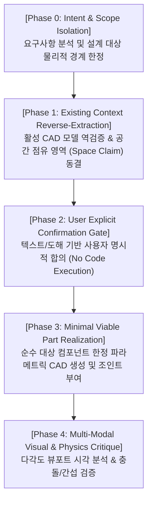

# Universal Engineering Agent Governance & Top-Down CAD Guidelines

본 문서는 모든 3D CAD, 로봇 메커니즘, 정밀 기계 설계 작업에서 AI 에이전트가 독단적인 코드 실행이나 본체 침범 없이, **체계적인 상태 전이와 시각적/물리적 검증을 거치도록 강제하는 범용 엔지니어링 가버넌스 프레임워크(Universal Engineering Governance Framework)**입니다.

---

## 1. 🛡️ 범용 엔지니어링 에이전트 4대 하드 게이트 (Universal Governance Framework)

### 🚦 Framework 1. State-Machine Workflow Gate (단계별 상태 전이 통제)
어떤 설계 프로젝트든 아래 4단계를 **순차적 하드 게이트(Hard Gate)**로 강제하며, 이전 단계의 사용자 합의 없이 다음 단계의 도구 실행(Tool Call)을 시스템적으로 차단한다.
* **[Phase 0: 의도 및 범위 정렬 (Scope Alignment)]**
  * 사용자 요구사항을 분석하고, **이번 턴에서 설계할 대상의 물리적 경계(Boundary of Responsibility)**를 엄격히 한정.
  * 사용자가 "검토", "논의", "확인"을 요구한 경우, 어떠한 CAD 빌드/수정 코드도 실행하지 않고 논의에만 집중.
* **[Phase 1: 기존 컨텍스트 역추출 (Reverse Context Extraction)]**
  * 새 형상을 만들기 전, 기존 모델의 B-Rep 바운딩 박스, 접촉면, 기구학적 결합 기준선을 API/스크린샷으로 먼저 역조회하여 고정(Freeze).
* **[Phase 2: 사용자 명시적 합의 (User Explicit Confirmation Gate)]**
  * 코드를 작성하지 않고, 부품이 안착될 공간(Envelope)과 주요 파라미터를 텍스트/도해로 사용자에게 제시하여 직접 텍스트 승인 획득.
  * **플랫폼 내부의 자동 승인 훅(Auto-Approval Hook)이 오더라도, 사용자의 실제 텍스트 합의가 없으면 실행으로 전이 금지.**
* **[Phase 3: 단품 상세화 및 기구학 구현 (Minimal Realization & Kinematics)]**
  * 승인된 인터페이스 규격 내에서만 파라메트릭 솔리드 생성 및 조인트 부여.

### 🔒 Framework 2. Non-Destructive Context-First Principle (현 모델 비파괴 및 공간 확보 원칙)
* 기존 CAD 어셈블리에 새 부품을 추가할 때, **"절대 기존 사용자 수정 형상을 침범(Intrusive Overlap/Cut)할 수 없다"**는 대원칙.
* 기존 모델이 차지하는 영역을 **금지 구역(Keep-Out Zone)**으로 선언하고, 신규 부품은 기준선(Skeleton) 상에 허용된 **공간 영역(Space Claim Envelope)** 내에만 배치.

### 🎯 Framework 3. Scope Isolation & Minimal Viable Part (설계 범위 격리 원칙)
* 사용자가 요청한 **"해당 모듈 단품"**만 생성하며, 환경 도구/지그/외부 카테터/임의의 와이어 루프 등 부수적인 가상 프록시 바디(Ghost Bodies) 생성을 엄격히 금지.
* 모션 시뮬레이션은 외부 도구를 3D 솔리드로 만들지 않고, **조인트의 자유도(Slider/Revolute) 및 변환 매트릭스(Matrix3D Transform)로만 순수 운동을 표현**하여 CAD 모델 트리를 깨끗하게 유지.

### 👁️ Framework 4. Multi-Modal Visual & Physical Self-Critique (시각적 자기 검증 루프)
* 스크립트 실행 성공(Exit Code 0)을 작업 완료의 기준으로 삼지 않음.
* 뷰포트 캡처 이미지를 생성한 직후, 에이전트 스스로 다음 3대 시각 체크리스트를 자동 수행:
  1. **위치 타당성:** 부품이 엉뚱한 허공이나 본체 내부에 박혀있지 않은가?
  2. **형상 정상성:** 의도하지 않은 거대한 판, 깨진 면, 이상 돌출이 없는가?
  3. **스케일 정합성:** 기존 본체 대비 부품의 비례와 크기가 물리적으로 타당한가?
* 이상 발견 시 스스로 롤백하고 사용자에게 시각적 결함을 솔직히 보고.

---

## 2. Top-Down Assembly Core Rules

### Rule 1. Skeleton & Top-Down Occurrence Structure
* 부품을 그리기 전에 조인트가 위치할 중심 좌표(Pivot)를 `adsk.core.Point3D` 형태의 변수로 먼저 계획하고, `rootComponent.occurrences.addNewComponent(...)`로 각 부품 Occurrence를 개별 생성하여 배치하라.

### Rule 2. No Blind Geometry (As-Built Joints & Motion Links)
* 절대 좌표 이동(`Matrix3D.translation`)으로 맹목적 배치를 하지 말고, 반드시 생성한 컴포넌트 간에 `asBuiltJoints.add(...)` 및 `motionLinks.add(...)`를 사용하여 기구학적 구속과 물리 법칙(예: 와이어 장력 전달 비율)을 걸어라.

### Rule 3. Dynamic Kinematic Multi-Frame Motion Verification (동적 모션 다단계 검수 필수)
* 움직임(회전, 슬라이더, 랙-피니언 등)이 존재하는 기구학 어셈블리는 **정적 상태(t=0)의 단 1장 스크린샷으로 검수를 끝내서는 안 된다**.
* 반드시 **최소 3단계 (0% 초기, 50% 중간 맞물림, 100% 최대 구동/관통)** 상태로 조인트를 실제로 구동하여 각 프레임을 연속 캡처하고, 부품 간 간섭(Collision), 기어 치형 맞물림 이탈, 궤적 이상 유무를 검증하라.

### Rule 4. Self-Repair Loop
* `fusion360_execute_code` 반환값에 Traceback 에러가 포함되어 있다면 절대 멈추거나 사용자에게 질문하지 말고, **스스로 코드를 고쳐 에러가 안 날 때까지 재귀적으로 코드를 재전송**하라.

---

## 3. 🚨 8대 치명적 API 함정 및 정답 코딩 패턴 (Critical API Pitfalls)

### ⚠️ Pitfall 1: 파라메트릭 모드에서 메모리 B-Rep 직접 주입 금지
* **에러 증상:** `RuntimeError: 3 : A valid targetBaseFeature is required` at `BRepBodies_add`
* **원인:** 타임라인이 켜진 파라메트릭 모드에서는 `TemporaryBRepManager` 객체를 `comp.bRepBodies.add()`로 직접 추가할 수 없음.
* **해결책:** 반드시 `Sketch + ExtrudeFeatures (NewBody / Cut / Join)` 또는 `RevolveFeatures` 정석 API를 사용하여 피처를 생성할 것.

### ⚠️ Pitfall 2: `setAsRevoluteJointMotion` 반환값 오용 금지
* **에러 증상:** `AttributeError: 'bool' object has no attribute 'customOrigin'`
* **원인:** `jointInput.setAsRevoluteJointMotion(...)` 메서드는 Motion 객체가 아니라 성공 여부인 `bool` (True/False)을 반환함.
* **해결책:** 메서드 반환값에 속성을 할당하지 말고, 조인트의 피벗 중심은 `JointGeometry` 생성 시점에 전달할 것.

### ⚠️ Pitfall 3: 파라메트릭 환경에서 독립 ConstructionPoint 생성 금지
* **에러 증상:** `RuntimeError: 3 : Environment is not supported` at `ConstructionPoints_add`
* **원인:** 파라메트릭 모드에서 스케치/피처 외부에서 `comp.constructionPoints.add()` 호출 시 환경 미지원 발생.
* **해결책:** 별도 참조점을 만들지 말고, 이미 생성된 실제 3D B-Rep Body의 `Circle3DCurveType` 또는 `Line3DCurveType` 모서리(Edge)를 검색하여 직접 조인트 참조 지오메트리로 사용할 것.

### ⚠️ Pitfall 4: As-Built Joint의 지오메트리 인자 래핑 누락 금지
* **에러 증상:** `TypeError: in method 'AsBuiltJoints_createInput', argument 4 of type 'Ptr<JointGeometry>'`
* **원인:** `asBuiltJoints.createInput(occ1, occ2, geo)`의 3번째 인자(C++ 4번째)는 순수 `BRepEdge` 객체를 직접 받을 수 없으며, 반드시 `JointGeometry` 포인터여야 함.
* **해결책:** 항상 `adsk.fusion.JointGeometry.createByCurve(edge, keyPointType)`로 래핑하여 전달할 것.

### ⚠️ Pitfall 5: HTTP execute_code 시 JSON 이중 직렬화/이스케이프 금지
* **에러 증상:** `TypeError: exec() arg 1 must be a string, bytes or code object`
* **원인:** PowerShell `Invoke-RestMethod`나 REST 클라이언트에서 JSON 본문 전송 시 따옴표나 개행이 이중 이스케이프되어 `json.loads()` 후 결과가 `dict`가 아닌 `str`로 남는 현상.
* **해결책:** 
  1. `/build` 엔드포인트를 통해 `src/build_endocrab_model.py` 파일 경로에서 직접 UTF-8 원본 문자열을 읽어 `exec()`하도록 일원화할 것.
  2. `exec_globals`에 `adsk`, `app`, `ui`, `__file__`, `__name__`을 항상 완벽히 공급할 것.

### ⚠️ Pitfall 6: Extrude Cut 연산 시 `participantBodies` 누락 및 2D 스케치 평면 투영 불일치 금지
* **에러 증상:** `RuntimeError: 3 : No target body found to cut or intersect!`
* **원인:** 3D 월드 축과 다른 ConstructionPlane에 스케치를 작성할 때 $(u, v)$ 로컬 좌표 오차로 인해 절단 프로파일이 솔리드 바디를 빗겨 나가거나, `participantBodies`를 지정하지 않아 타겟 바디를 찾지 못함.
* **해결책:**
  1. 관통 구멍 절단 시 반드시 `cut_feature_input.participantBodies = [target_body]`를 명시할 것.
  2. 스케치 평면을 3D 기준축($X-Y, Y-Z, Z-X$)에 정확히 일치시키고 양방향 대칭 관통(`setDistanceExtent(True, ...)`)으로 확실하게 관통시킬 것.

### ⚠️ Pitfall 7: 하위 컴포넌트(Sub-occurrence)에 `isGrounded` 설정 금지
* **에러 증상:** `RuntimeError: 3 : isGrounded property is not available for the occurrence of a sub component.`
* **원인:** Fusion 360 API 아키텍처상 `isGrounded = True`는 `rootComponent`의 직속 최상위 Occurrence에만 적용 가능함.
* **해결책:** 최상위 어셈블리 Occurrence에만 `isGrounded = True`를 걸고, 하위 컴포넌트 간 상대 구속은 `parent_comp.asBuiltJoints`를 사용하여 내부 Joint로만 구속할 것.

### ⚠️ Pitfall 8: `ConstructionPlane` 객체의 `isVisible` 프로퍼티 수정 금지
* **에러 증상:** `AttributeError: property '_get_isVisible' of 'ConstructionPlane' object has no setter`
* **원인:** `Sketch` 객체는 `isVisible = False`를 지원하지만, `ConstructionPlane` 객체는 `isVisible` 프로퍼티의 setter가 없는 읽기 전용 속성임.
* **해결책:** 뷰포트 정리 시 `comp.sketches`의 `isVisible = False`만 순회 제어하고, `comp.constructionPlanes`는 건드리지 말 것.
